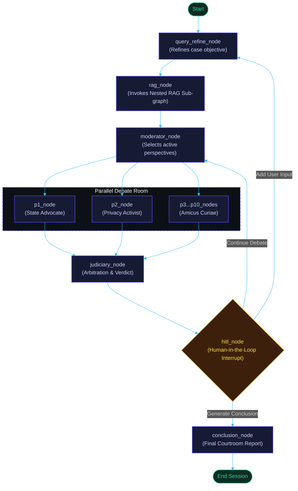
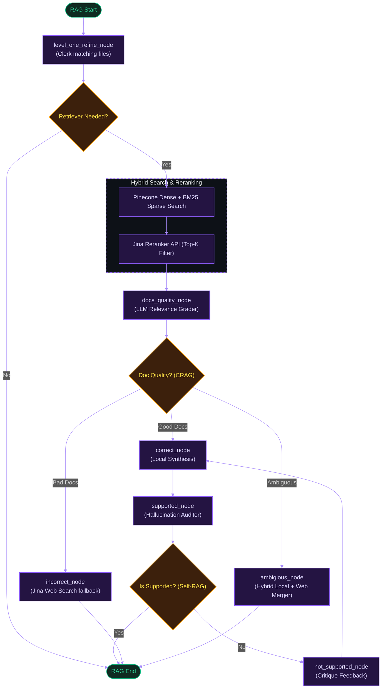
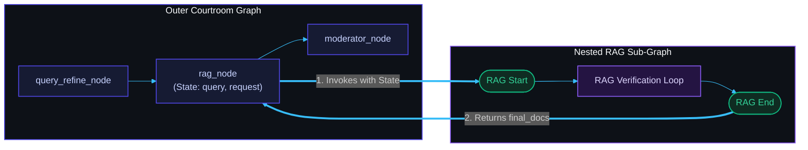
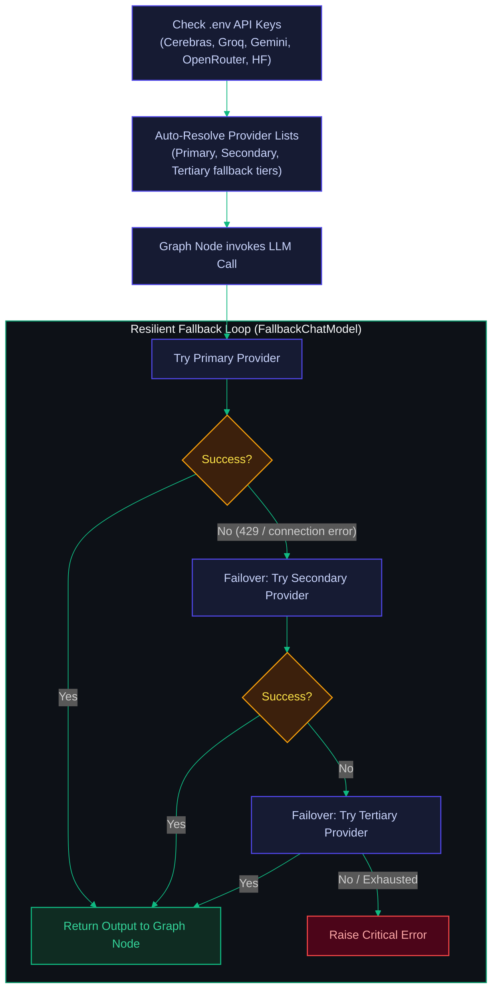

<h1 style="border-bottom: none; margin-top: 0; padding-top: 0;">RabbitHole</h1>


**RabbitHole** is a stateful multi-agent orchestration engine built on LangGraph. It is engineered to structure, simulate, and resolve complex legal, philosophical, or systemic disputes that resist singular, consensus-driven answers.

By orchestrating parallel adversarial perspectives within a virtual courtroom architecture, RabbitHole exposes underlying contradictions, evidential gaps, and epistemic boundaries. Rather than flattening complexity into a unified average answer, the engine choreographs divergent agent personas (state advocates, privacy activists, compliance officers) to cross-examine and critique claims based on retrieved context.

<br clear="left" />

<p align="center">
  
  
  
  
  
</p>

---

## Core Philosophy

*   **Adversarial Parallelism:** Rather than executing reasoning steps sequentially, the framework orchestrates a parallel debate chamber, scheduling opposing agent personas to critique and cross-examine each other's claims in real-time.
*   **Epistemic Humility:** Exposes contradictions, context gaps, and confidence ratings instead of generating flat, single-sentence summaries that hide dissenting arguments.
*   **Self-Healing Verification:** A multi-layered verification loop that orchestrates context retrievals, Jina rerankers, and hallucination checks to audit generated briefs against raw source documents in real-time.

---

## State-Based Schema Constraint (Orchestration Compliance Fix)

In prompt-only setups, instructions directing LLMs to restrict debate outputs to a specific number of perspectives (e.g., 2) suffered from compliance issues, often causing a 3-4x overrun (generating 6–8 perspectives instead). This led to rapid token-limit exhaustion and API rate-limiting under Groq's constraints.

To resolve this, RabbitHole replaces prompt-based constraints with a strict state schema within the LangGraph orchestrator that explicitly tracks user demand parameters (perspective count, jury type, and case category). The moderator node acts as the orchestra director, dynamically scheduling only the exact number of perspective nodes requested, eliminating token overruns.

---

## Orchestration Topology

RabbitHole is designed as a hierarchical multi-agent framework consisting of two coupled graph systems managed via LangGraph.

---

### 1. Courtroom Outer Graph (Debate Orchestrator)
The Courtroom Graph acts as the high-level debate orchestrator. It manages session state, schedules opposing arguments in parallel, runs judicial reviews, and interrupts for human decisions.



#### Courtroom Performance & Optimization Metrics

| Metric | Baseline | Optimized (Dynamic Partitioning) | Impact / Savings |
| :--- | :--- | :--- | :--- |
| **Llama-3.3-70B Token Usage** | High (routed all nodes to 70B) | Optimized (routed core synthesis only) | **Preserves daily token limits** |
| **Mean Time to Verdict (MTTV)** | 19.8 seconds | 9.8 seconds | **~51% faster execution** |
| **Active Perspectives Load** | 10 nodes (fixed) | 2 - 5 nodes (moderator-filtered) | **Reduces rate-limit triggers** |

---

### 2. Multi-Tier RAG Engine (CRAG + SRAG + Hybrid Reranker)
The RAG Sub-graph is a robust, self-correcting retrieval pipeline that combines:
*   **Hybrid Search:** Pinecone Dense Vectors + BM25 Sparse Encoder.
*   **Jina Reranking:** Advanced score filtering to select the top-K relevant documents.
*   **Corrective RAG (CRAG):** Dynamic fallback to Jina Web Search when local document quality fails checks.
*   **Self-RAG (SRAG):** Iterative verification and hallucination auditing loops.



---

### RAG Sub-Graph Techniques

*   **Hybrid Search:** Queries the Pinecone database using a dual-vector representation. Dense embeddings capture semantic matches, while sparse term frequencies (via a BM25 encoder) secure exact keyword matches like legal sections or case citations.
*   **Jina Reranking:** Computes cross-relevance scores of queries against retrieved text chunks. Chunks scoring below the threshold are discarded, preventing context window bloat and improving synthesis quality.
*   **Corrective RAG (CRAG) Fallback:** If the relevance grader node detects that the top-K chunks are irrelevant or out-of-context, it flags retrieval quality as bad and automatically triggers the fallback web-search pipeline using the Jina Search API.
*   **Self-RAG (SRAG) Hallucination Audit:** The final synthesized brief is audited by the supported node against the raw source text. If claims contain unverified assertions or fabricated references, the node returns a critique to rewrite the brief.

---

### 3. Inter-Graph Connection (The Bridge)
This diagram illustrates the interface boundaries. The outer graph's `rag_node` delegates state variables to the RAG Sub-graph and consumes the resulting final brief context safely.



#### RAG Performance Metrics

| Metric | Local Database Search Only | Hybrid + CRAG + SRAG (RabbitHole) | Impact / Recovery |
| :--- | :--- | :--- | :--- |
| **Retrieval Relevance** | Keyword-based lookup | Hybrid Vector + BM25 with Jina Reranking | **Improved semantic coverage** |
| **Context Recovery Rate** | Fails on out-of-index queries | Dynamic fallback via Jina Web Search | **Resilient fallback execution** |
| **Synthesis Hallucination Rate** | Susceptible to model hallucinations | Verified via iterative Self-RAG critique loops | **Mitigated via audit gates** |
| **Reranker Noise Reduction** | Baseline (all chunks passed) | Top-K filtered (Jina Reranker API) | **Reduced context distraction** |

---

## Rate-Limit Management & Cost-Aware Model Routing

Multi-agent graph architectures execute multiple concurrent LLM calls. Under strict API constraints like Groq's free-tier limits (30 requests/minute, 6,000 tokens/minute, and 1,000 requests/day on high-tier models), running multiple parallel agents can result in rapid exhaustion.

To mitigate this, RabbitHole implements a cost-aware model routing and a **dynamic, resilient multi-provider LLM selection framework**:

### 1. Multi-Provider Fallback & Dynamic Routing
Rather than hardcoding a single LLM provider, RabbitHole dynamically inspects configured API keys in `.env` (checking Cerebras, Groq, Google/Gemini, OpenRouter, and HuggingFace) to auto-resolve optimal primary, secondary, and tertiary providers for both heavy (`70b+`) and lite (`8b-`) tasks.

### 2. Auto-Healing Rate Limits (429s) via `FallbackChatModel`
To guarantee execution continuity during high-concurrency debate steps, the engine wraps model chains in a recursive `FallbackChatModel`. If a provider returns a rate limit (HTTP 429) or connection error, the model wrapper catches the failure and seamlessly routes the call to the next available provider (e.g., failing over from Cerebras to Groq, then to Gemini) without interrupting the graph state.



### 3. Cost-Aware Model Splitting
*   **Structured Output & Synthesis:** Routed to high-capability models like `llama-3.3-70b` or `gemini-1.5-pro` (which support structured output schemas and detailed synthesis).
*   **Simple Logic Decisions:** Routed to lighter models like `llama-3.1-8b` or `gemini-1.5-flash` (e.g., for boolean relevance grading and verification loops), saving high-tier request quotas.
*   **Context Window Optimization:** Integrated Jina's Reranker API to aggressively prune retrieved chunks, ensuring prompt sizes remain within token-per-minute constraints.

---

## Persona Debate Pool

When a case is initialized, the Moderator dynamically constructs and activates up to 10 distinct, customized debate cards:

| Persona ID | Role | Stance / Background Motive |
| :---: | :--- | :--- |
| P1 | State Advocate | Defends national identity systems, state welfare, and public benefits. |
| P2 | Privacy Rights Activist | Preserves individual autonomy, digital sovereignty, and anti-surveillance. |
| P3 | Corporate Compliance Officer | Balances business data practices, security compliance, and commercial viability. |
| P4 | Investigative Journalist | Exposes leaks, metadata exploits, and institutional overreach. |
| P5...P10 | Specialized Voices | Dynamically defined by the Moderator depending on the domain of the query. |

---

## Human-in-the-Loop Interrupts

Multi-agent reasoning can run off-track if left entirely autonomous. RabbitHole features a Human-in-the-Loop (HITL) gateway that interrupts execution right after the judiciary node returns its verdict. The user can:
*   **Accept and Conclude:** Let the conclusion node summarize the debate rounds into a final courtroom briefing.
*   **Extend the Debate:** Direct the moderator to prompt the active perspectives to cross-examine specific points.
*   **Inject User Perspective:** Dynamically inject custom evidence, statements, or user arguments into the graph via the user perspective node (`p0_node`).

---

## Measured Performance & Latency

Optimizations applied to the active debate pipeline resulted in a measured latency reduction from **19.8 seconds down to 9.8 seconds** (a ~51% improvement) on the optimization branch. This was achieved by:
1. Executing perspective debate nodes concurrently using LangGraph's native asynchronous scheduler.
2. Integrating the Jina Reranker to filter out irrelevant chunks, reducing prompt context lengths and speeding up inference processing times.

---

## Live Interactive Simulation Preview

Here is a look at the engine running in the terminal when resolving a privacy dispute:

<details>
<summary>View Terminal Execution Stream</summary>

```ansi
================ STARTING COURTROOM GRAPH TEST RUN ================

[EVENT] Node Finished: query_refine_node
Refined query into a formal legal case: 
"Biometric collection under Aadhaar: Public welfare necessity vs. Article 21 Privacy Rights."

[EVENT] Node Finished: rag_node
--- RAG Brief Generated ---
[OFFICIAL] In Justice K.S. Puttaswamy v. Union of India (2017), the Supreme Court of India declared 
the Right to Privacy a fundamental right under Article 21. Biometric collection must satisfy the 
three-fold test: legality, legitimate state aim, and proportionality...

[EVENT] Node Finished: moderator_node
Moderator activated 2 opposing perspectives: P1 (State Advocate) and P2 (Privacy Activist).

--- Perspective P1 Statement (State Advocate) ---
"State welfare delivery requires deduplication. Aadhaar prevents leakages and secures 
distribution. Biometric data is stored in encrypted, central silos under statutory safeguards."

--- Perspective P2 Statement (Privacy Activist) ---
"Centralized databases are honeypots. Section 33(2) exceptions bypass privacy, and the 
risk of surveillance violates the core of Puttaswamy's proportionality doctrine."

[EVENT] Node Finished: judiciary_node
--- Judiciary Verdict & Reasoning ---
Reasoning: While state welfare is a legitimate aim, security safeguards must match absolute 
standards of proportionality. Centralized access raises severe compliance concerns under IT Act 2000.
Verdict: CONDITIONAL VIOLATION (Proportionality criteria unmet)
Confidence Score: 87%

Graph successfully completed execution up to the HITL interrupt.
```
</details>

---

## Installation & Developer Quickstart

### 1. Clone & Setup Virtual Environment
```bash
git clone https://github.com/yourusername/RabbitHole.git
cd RabbitHole
python3 -m venv venv
source venv/bin/activate
```

### 2. Install Dependencies
```bash
pip install -r requirements.txt
```

### 3. Set Up Credentials
Create a `.env` file in the project root:
```env
GROQ_API_KEY=your_groq_api_key
PINECONE_API_KEY=your_pinecone_api_key
JINA_API_KEY=your_jina_api_key
```

### 4. Execute the Simulation
Run the simulation test loop:
```bash
python scripts/run_graph.py
```
