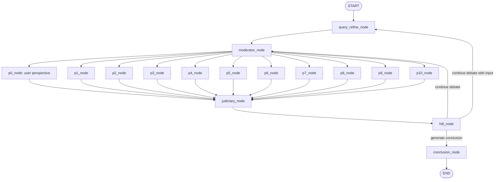

# RabbitHole

RabbitHole is an AI exploration engine for questions that are too tangled for a single answer.

It is built to unpack disputes, incentives, contradictions, missing context, and competing narratives. Instead of saying "here is the answer," RabbitHole stages the issue as an investigation and lets multiple perspectives argue, remember, revise, and converge toward a final reading.

```txt
Ask a messy question.
RabbitHole turns it into a structured exploration.
```

## Current Focus

The active build is the **Courtroom** mode: a LangGraph-powered multi-agent debate where a moderator assigns roles, perspectives argue in parallel, a judiciary responds, and the user can continue, add input, or generate a final conclusion.

Other RabbitHole modes are planned, but Courtroom is the first working spine of the system.

## What It Does

- Refines the user's initial topic into a courtroom-ready case.
- Uses a moderator to decide how many perspectives should participate.
- Assigns roles such as citizens, institutions, lawyers, activists, businesses, journalists, or other topic-specific voices.
- Runs active perspective nodes in parallel.
- Tracks private thoughts, public statements, and memory summaries for each perspective.
- Lets the judiciary reason over public statements and produce a verdict, confidence score, and round summary.
- Supports human-in-the-loop control after each round:
  - continue debate
  - continue debate with input
  - generate conclusion
- Produces a final courtroom-style report when the user ends the session.

## Courtroom Graph



The graph intentionally stays simple:

- `graph.py` wires nodes and edges.
- `route.py` decides where to go after HITL.
- `state.py` describes the state shape.
- `reducers.py` merges parallel perspective updates.

## How The Round Works

1. `query_refine_node` cleans the initial user topic.
2. `moderator_node` creates role cards once and decides whether the judiciary is corrupt or neutral.
3. `p0_node` through `p10_node` run as parallel perspective generators.
4. Inactive or missing perspectives return nothing, so unused nodes are harmless.
5. `judiciary_node` reads public statements and creates:
   - reasoning
   - verdict
   - confidence
   - latest overall round summary
6. `hitl_node` pauses for user direction.
7. `conclusion_node` generates the final courtroom report.

## Project Structure

```txt
RabbitHole/
|-- app/
|   `-- courtroom/
|       |-- graph/
|       |   |-- graph.py
|       |   |-- reducers.py
|       |   |-- route.py
|       |   `-- state.py
|       |-- models/
|       |   `-- llm.py
|       |-- nodes/
|       |   |-- conclusion_node.py
|       |   |-- hitl_node.py
|       |   |-- judiciary_node.py
|       |   |-- moderator_node.py
|       |   |-- perspective_node.py
|       |   `-- query_refine_node.py
|       `-- prompts/
|           |-- conclusion_prompt.py
|           |-- judiciary_prompt.py
|           |-- moderator_prompt.py
|           |-- perspective_prompt.py
|           `-- query_refine_prompt.py
|-- data/
|-- docs/
|-- infra/
|-- scripts/
|-- tests/
|-- requirements.txt
`-- README.md
```

## Tech Stack

- Python
- LangGraph
- LangChain Core
- LangChain Ollama
- Pydantic
- Ollama local models

Current model wiring lives in `app/courtroom/models/llm.py`.

## Setup

Create a virtual environment and install dependencies:

```bash
python3 -m venv venv
source venv/bin/activate
pip install -r requirements.txt
```

Make sure Ollama is running locally and the model names configured in `app/courtroom/models/llm.py` exist on your machine. The current defaults are:

```txt
gemma4
qwen3.6
```

The graph can be imported from:

```python
from graph.graph import courtroom_app
```

When running scripts directly, use `app/courtroom` as the import root.

## Status

Implemented:

- Courtroom graph
- Parallel perspective execution
- Human-in-the-loop routing
- User perspective injection through `p0_node`
- Judiciary reasoning, verdict, confidence, and round summary
- Final conclusion node

In progress / next:

- End-to-end runner script
- API layer
- Tests for graph routing and reducers
- Persistence for sessions and memory
- Retrieval and evidence cards

Planned modes:

- Timeline
- Knowledge Graph
- Contradiction Finder

## Philosophy

RabbitHole is for questions where the interesting part is not the final sentence, but the structure underneath it:

```txt
Who benefits?
Who is hiding something?
Which claims contradict each other?
What context is missing?
What would change the verdict?
```

The goal is not to make the AI sound certain. The goal is to make uncertainty inspectable.
