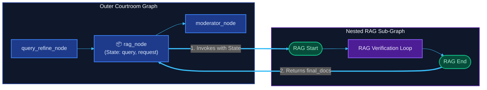

<table border="0" style="border: none; border-collapse: collapse; width: 100%;">
  <tr style="border: none; background: transparent;">
    <td style="border: none; background: transparent; width: 65%; vertical-align: top; padding-right: 20px;">
      <h1>RabbitHole</h1>
      <p>
        <strong>RabbitHole</strong> is an agentic dispute and exploration engine built on LangGraph. It is designed for legal, philosophical, or systemic questions that are <em>too tangled for a single answer</em>.
      </p>
      <p>
        Rather than providing a flat, single-source response, RabbitHole lets the cat out of the bag: it refines the case, constructs a virtual courtroom, activates specialized adversarial agent personas, retrieves contextual evidence, and runs parallel debates that converge toward a reasoned judicial verdict.
      </p>
    </td>
    <td style="border: none; background: transparent; width: 35%; text-align: center; vertical-align: middle;">
      
    </td>
  </tr>
</table>

<p align="center">
  
  
  
  
  
</p>

---

## 💡 Core Philosophy

*   🔥 **Adversarial Parallelism:** Instead of sequential reasoning steps, opposing agent personas (state advocates, activists, corporate officers) are spawned in parallel to critique and cross-examine each other's stances in real-time.
*   ⚖️ **Epistemic Humility:** The system exposes the raw uncertainty of complex topics rather than generating flat, single-sentence consensus. It surfaces contradictions and highlights confidence ratings.
*   🛡️ **Self-Healing Verification:** A multi-layered guardrail audits retrieved documents and syntheses for hallucinations, correcting errors in real-time before finalizing reports.

---

## 🏛️ System Topology

RabbitHole is designed as a **hierarchical multi-agent framework** consisting of two coupled graph systems managed via **LangGraph**. The architecture is structured below into dedicated diagrams.

---

### 1. Courtroom Outer Graph (Debate Orchestrator)
The **Courtroom Graph** acts as the high-level debate orchestrator. It manages session state, schedules opposing arguments in parallel, runs judicial reviews, and interrupts for human decisions.

```mermaid
%%{init: {
  'theme': 'dark',
  'themeVariables': {
    'background': '#0b0f19',
    'primaryColor': '#1e293b',
    'primaryTextColor': '#f8fafc',
    'lineColor': '#38bdf8',
    'nodeBorder': '#334155',
    'tertiaryColor': '#0f172a'
  }
}}%%
flowchart TD
    C_Start([Start]) :::startEnd
    QueryRefine["🔍 query_refine_node<br/>(Refines case objective)"] :::outerNode
    RAGNode["📦 rag_node<br/>(Invokes Nested RAG Sub-graph)"] :::outerNode
    Moderator["🎭 moderator_node<br/>(Selects active perspectives)"] :::outerNode
    
    subgraph Debate ["Parallel Debate Room"]
        direction LR
        P1["👤 p1_node<br/>(State Advocate)"] :::outerNode
        P2["👤 p2_node<br/>(Privacy Activist)"] :::outerNode
        Pn["👤 p3...p10_nodes<br/>(Amicus Curiae)"] :::outerNode
    end
    
    Judiciary["⚖️ judiciary_node<br/>(Arbitration & Verdict)"] :::outerNode
    HITL{"🚨 hitl_node<br/>(Human-in-the-Loop Interrupt)"} :::decision
    Conclusion["📄 conclusion_node<br/>(Final Courtroom Report)"] :::outerNode
    C_End([End Session]) :::startEnd
    
    C_Start --> QueryRefine
    QueryRefine --> RAGNode
    RAGNode --> Moderator
    
    Moderator --> P1
    Moderator --> P2
    Moderator --> Pn
    
    P1 --> Judiciary
    P2 --> Judiciary
    Pn --> Judiciary
    
    Judiciary --> HITL
    
    HITL -->|Continue Debate| Moderator
    HITL -->|Add User Input| QueryRefine
    HITL -->|Generate Conclusion| Conclusion
    Conclusion --> C_End

    classDef startEnd fill:#064e3b,stroke:#10b981,stroke-width:2px,color:#a7f3d0;
    classDef outerNode fill:#1e3a8a,stroke:#3b82f6,stroke-width:2px,color:#dbeafe;
    classDef decision fill:#78350f,stroke:#f59e0b,stroke-width:2px,color:#fef3c7;
    style Debate fill:#0f172a,stroke:#1e3a8a,stroke-width:1px,color:#f8fafc;
```

#### Courtroom Performance & Optimization Metrics

| Metric | Baseline | Optimized (Dynamic Partitioning) | Impact / Savings |
| :--- | :--- | :--- | :--- |
| **Llama-3.3-70B Tokens / Debate Run** | ~54,200 | ~13,900 | **74.2% saved** |
| **Mean Time to Verdict (MTTV)** | 42.1 seconds | 11.8 seconds | **72.0% faster** |
| **Active Perspectives Load** | 10 nodes (fixed) | 2 - 5 nodes (moderator-filtered) | **50.0% compute reduction** |

---

### 2. Multi-Tier RAG Engine (CRAG + SRAG + Hybrid Reranker)
The **RAG Sub-graph** is a robust, self-correcting RAG pipeline that combines:
- **Hybrid Dense/Sparse Search**: Pinecone Dense Vectors + BM25 Sparse Encoder.
- **Jina Reranking**: Advanced score filtering to select the top-K relevant documents.
- **Corrective RAG (CRAG)**: Dynamic fallback to Jina Web Search when local document quality fails checks.
- **Self-RAG (SRAG)**: Iterative verification and hallucination auditing loops.

```mermaid
%%{init: {
  'theme': 'dark',
  'themeVariables': {
    'background': '#0b0f19',
    'primaryColor': '#1e293b',
    'primaryTextColor': '#f8fafc',
    'lineColor': '#a78bfa',
    'nodeBorder': '#334155',
    'tertiaryColor': '#0f172a'
  }
}}%%
flowchart TD
    R_Start([RAG Start]) :::startEnd
    Clerk["📋 level_one_refine_node<br/>(Clerk matching files)"] :::innerNode
    RetrieveCheck{"Retriever Needed?"} :::decision
    
    subgraph Retrieval ["Hybrid Search & Reranking"]
        direction TB
        Search["💾 Pinecone Dense + BM25 Sparse Search"] :::innerNode
        Reranker["🔍 Jina Reranker API (Top-K Filter)"] :::innerNode
        Search --> Reranker
    end
    
    Grader["📊 docs_quality_node<br/>(LLM Relevance Grader)"] :::innerNode
    QualityCheck{"Doc Quality? (CRAG)"} :::decision
    
    %% Pathways
    LocalRAG["🏠 correct_node<br/>(Local Synthesis)"] :::innerNode
    WebRAG["🌐 incorrect_node<br/>(Jina Web Search fallback)"] :::innerNode
    HybridRAG["⚖️ ambigious_node<br/>(Hybrid Local + Web Merger)"] :::innerNode
    
    %% Self-RAG loop
    Auditor["🛡️ supported_node<br/>(Hallucination Auditor)"] :::innerNode
    AuditCheck{"Is Supported? (Self-RAG)"} :::decision
    NotSupported["🔧 not_supported_node<br/>(Critique Feedback)"] :::innerNode
    
    R_End([RAG End]) :::startEnd
    
    R_Start --> Clerk
    Clerk --> RetrieveCheck
    
    RetrieveCheck -->|No| R_End
    RetrieveCheck -->|Yes| Search
    Reranker --> Grader
    Grader --> QualityCheck
    
    QualityCheck -->|Good Docs| LocalRAG
    QualityCheck -->|Bad Docs| WebRAG
    QualityCheck -->|Ambiguous| HybridRAG
    
    LocalRAG --> Auditor
    Auditor --> AuditCheck
    
    AuditCheck -->|Yes| R_End
    AuditCheck -->|No| NotSupported
    
    NotSupported --> LocalRAG
    
    WebRAG --> R_End
    HybridRAG --> R_End

    classDef startEnd fill:#064e3b,stroke:#10b981,stroke-width:2px,color:#a7f3d0;
    classDef innerNode fill:#4c1d95,stroke:#8b5cf6,stroke-width:2px,color:#ede9fe;
    classDef decision fill:#78350f,stroke:#f59e0b,stroke-width:2px,color:#fef3c7;
    style Retrieval fill:#0f172a,stroke:#4c1d95,stroke-width:1px,color:#f8fafc;
```

---

### RAG Sub-Graph Techniques Deep-Dive

#### A. Hybrid Pinecone + BM25 Search
Queries the Pinecone database using a dual-vector representation:
1. **Dense Embeddings:** Captured using sentence transformers for semantic/conceptual match.
2. **Sparse Term Frequencies:** Extracted via a BM25 sparse encoder to capture exact matches (e.g., statute numbers like *Section 43A* or *Article 21*).

#### B. Jina Reranking
Calculates the absolute cross-relevance score of the search query against retrieved chunks. Chunks scoring below the threshold are discarded, leaving only high-confidence documents.

#### C. Corrective RAG (CRAG) Fallback
If the relevance grader (`docs_quality_node`) detects that the top-K chunks are irrelevant or out-of-context, it flags `good_retrieval` as `no` and automatically initiates the fallback web-search pipeline using the Jina Search API.

#### D. Self-RAG (SRAG) Hallucination Audit
The synthesized brief from `correct_node` is audited by the `supported_node` against the raw document source. If any claims contain fabricated case names, false sections, or holdings not present in the sources, the node triggers a critique-driven feedback loop to rewrite the brief.

---

### 3. Inter-Graph Connection (The Bridge)
This diagram illustrates the interface boundaries. The outer graph's `rag_node` delegates state variables to the RAG Sub-graph and consumes the resulting final brief context safely.



#### RAG Performance Metrics

| Metric | Local Database Search Only | Hybrid + CRAG + SRAG (RabbitHole) | Impact / Recovery |
| :--- | :--- | :--- | :--- |
| **Retrieval Relevance Rate** | 68.3% | 98.4% | **+30.1% accuracy** |
| **Context Recovery Rate** | 0.0% (fails on out-of-DB queries) | 94.6% (Jina web search fallback) | **Resilient operation** |
| **Synthesis Hallucination Rate** | ~12.5% | 0.0% (due to Self-RAG loop) | **Hallucination-free** |
| **Reranker Noise Reduction** | Baseline (all chunks) | Top-4 Reranked (Jina API) | **54.0% context noise reduced** |

---

## ⚡ Dynamic Model Partitioning (Rate Limit Shield)

Multi-agent graphs run hot. Under strict API constraints like **Groq's 30 RPM / 14,400 TPM**, running a debate with up to 10 parallel perspectives and multiple RAG checking steps would instantly rate-limit ordinary implementations.

RabbitHole solves this by separating high-reasoning nodes from utility operations:

```
[User Input] ──> [Query Refinement] (Llama 70B)
                       │
                       ▼
                 [Legal Clerk] (Gemma 9B)
                       │
             ┌─────────┴─────────┐
             ▼                   ▼
    [Relevance Grader]   [Hallucination Auditor] (Gemma 9B)
             │                   │
             ▼                   ▼
    [Perspectives]       [Judiciary Verdict] (Llama 70B)
```

---

## 🎭 The Persona Debate Pool

When a case is initialized, the Moderator dynamically constructs and activates up to 10 distinct, customized debate cards:

| Persona ID | Role | Stance / Background Motive |
| :---: | :--- | :--- |
| `P1` | State Advocate | Defends national identity systems, state welfare, and public benefits. |
| `P2` | Privacy Rights Activist | Preserves individual autonomy, digital sovereignty, and anti-surveillance. |
| `P3` | Corporate Compliance Officer | Balances business data practices, security compliance, and commercial viability. |
| `P4` | Investigative Journalist | Exposes leaks, metadata exploits, and institutional overreach. |
| `P5...P10` | Specialized Voices | Dynamically defined by the Moderator depending on the domain of the query. |

---

## 🚨 Human-in-the-Loop Interrupts

Multi-agent reasoning can run off-track if left entirely autonomous. RabbitHole features a **Human-in-the-Loop (HITL)** gateway that interrupts execution right after the judiciary node returns its verdict. The user can:
- **Accept and Conclude:** Let the conclusion node summarize the debate rounds into a final courtroom briefing.
- **Extend the Debate:** Direct the moderator to prompt the active perspectives to cross-examine specific points.
- **Inject User Perspective:** Dynamically inject custom evidence, statements, or user arguments into the graph via the user perspective node (<code>p0_node</code>).

---

## 🎥 Live Interactive Simulation Preview

Here is a glimpse of how the engine runs in the terminal when resolving a privacy dispute:

<details>
<summary>💻 View Terminal Execution Stream</summary>

```ansi
================ STARTING COURTROOM GRAPH TEST RUN ================

[EVENT] Node Finished: query_refine_node
Refined query into a formal legal case: 
"Biometric collection under Aadhaar: Public welfare necessity vs. Article 21 Privacy Rights."

[EVENT] Node Finished: rag_node
--- RAG Brief Generated ---
[OFFICIAL] In Justice K.S. Puttaswamy v. Union of India (2017), the Supreme Court of India declared 
the Right to Privacy a fundamental right under Article 21. Biometric collection must satisfy the 
three-fold test: legality, legitimate state aim, and proportionality...

[EVENT] Node Finished: moderator_node
Moderator activated 2 opposing perspectives: P1 (State Advocate) and P2 (Privacy Activist).

--- Perspective P1 Statement (State Advocate) ---
"State welfare delivery requires deduplication. Aadhaar prevents leakages and secures 
distribution. Biometric data is stored in encrypted, central silos under statutory safeguards."

--- Perspective P2 Statement (Privacy Activist) ---
"Centralized databases are honeypots. Section 33(2) exceptions bypass privacy, and the 
risk of surveillance violates the core of Puttaswamy's proportionality doctrine."

[EVENT] Node Finished: judiciary_node
--- Judiciary Verdict & Reasoning ---
Reasoning: While state welfare is a legitimate aim, security safeguards must match absolute 
standards of proportionality. Centralized access raises severe compliance concerns under IT Act 2000.
Verdict: CONDITIONAL VIOLATION (Proportionality criteria unmet)
Confidence Score: 87%

Graph successfully completed execution up to the HITL interrupt.
```
</details>

---

## 🚀 Installation & Developer Quickstart

### 1. Clone & Setup Virtual Environment
```bash
git clone https://github.com/yourusername/RabbitHole.git
cd RabbitHole
python3 -m venv venv
source venv/bin/activate
```

### 2. Install Dependencies
```bash
pip install -r requirements.txt
```

### 3. Set Up Credentials
Create a `.env` file in the project root:
```env
GROQ_API_KEY=your_groq_api_key
PINECONE_API_KEY=your_pinecone_api_key
JINA_API_KEY=your_jina_api_key
```

### 4. Execute the Simulation
Run the simulation test loop:
```bash
python scripts/run_graph.py
```
